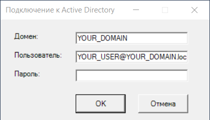
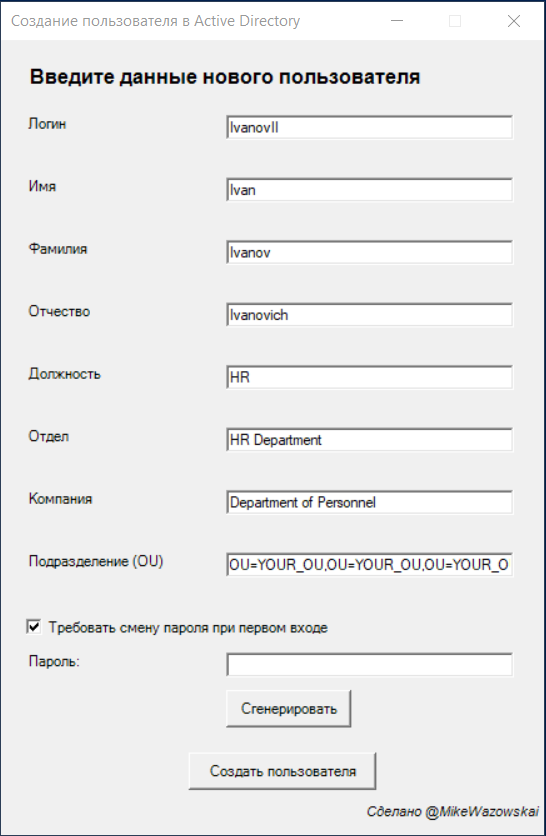
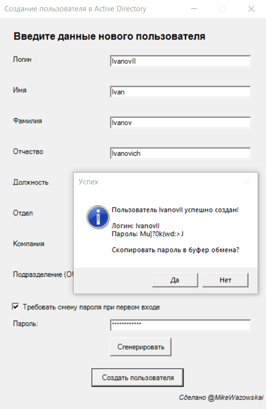
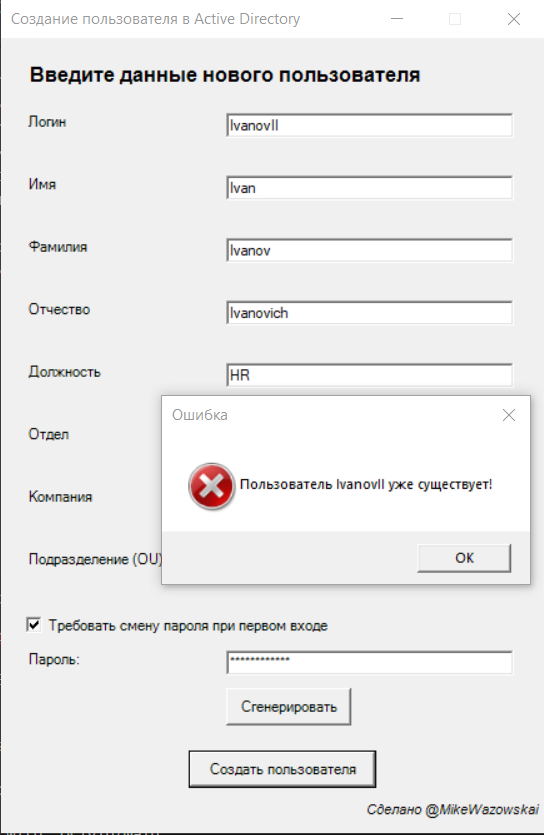

# Creating a user in a domain
1) Создайте файл PowerShell у себя на локальном компьютере с расширением .ps1
2) Вставьте содержимое файла add_user_ad.md
3) Замените в файле **YOUR_DOMAIN** на ваш домен
4) Найдите строчку $textBox.Text = "OU=YOUR_OU,OU=YOUR_OU,OU=YOUR_OU,DC=YOUR_DOMAIN,DC=local и замените на свой путь по умолчанию
5) Запустите PowerSheell от имени администратора
или создать файл .bat и вставить этот код
```
@echo off
echo Running PowerShell script as administrator...

:: Запуск PowerShell с правами администратора
powershell.exe -NoProfile -ExecutionPolicy Bypass -Command "& {Start-Process PowerShell -ArgumentList '-NoProfile -ExecutionPolicy Bypass -File ""C:\path\path\path\path\path\add_user_ad.ps1""' -Verb RunAs}"

:: Выход
exit

```
6) Перейдите по пути к вашему вайлу и запустите его

**Окно подключения к Active Directory**


**Окно предупреждения о неверном пароле**


**Окно создания пользователя в Active Directory**


**Окно генерации пароля**

*Можно нажать кнопку сгенерировать, тогда он сам вставит пароль под ***** или написать свой пароль. При нажатии кнопки "Создать пользователя" программа покажет "Логин" и "Пароль" и предложит его скопировать в буфер обмена*

**Окно если пользователь уже существует**
